<p align="center">
  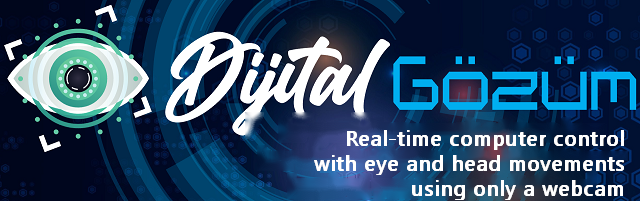
</p>

# myDigitalEye (Dijital Gözüm)

Hands-free computer control for people with physical disabilities: move the mouse, click and trigger shortcuts with eye, eyebrow and head movements, using only a standard webcam.

> This project was built in 10th grade (2020-21) as a personal initiative and was submitted to TÜBİTAK/TEKNOFEST. It was reorganized and cleaned up in 2026 for public release; the original versions and documentation are preserved in the archive/ and docs/ folders.

<p align="center">
  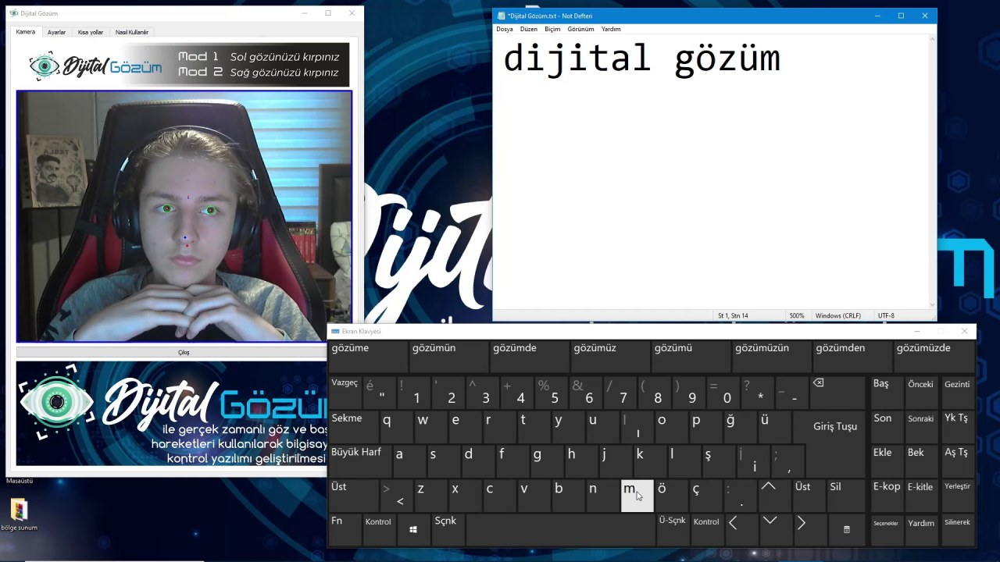
  <br>
  <em>Mode 2: typing "dijital gözüm" on the Windows on-screen keyboard with eye movements only (March 2021 recording).</em>
</p>

## Motivation

The idea came after watching *The Theory of Everything*, the film about Stephen Hawking. Hawking lost almost all voluntary movement to motor neurone disease and, for decades, operated his computer through specialised hardware, in his later years a sensor that picked up the movement of a single cheek muscle. The film made a simple point hard to ignore: for someone who cannot use their hands, the computer interface decides how much of the world they can reach.

Looking at what was available to people in a similar situation, three problems stood out:

- **Cost.** Commercial eye-tracking and head-pointing devices found during the research cost roughly 1,500 to 3,500 euros.
- **Availability.** Many were not sold in most countries or were out of stock.
- **Extra hardware.** Almost all required dedicated infrared cameras, head mounts or chin rests, and their software was closed source.

Many people who cannot use their arms or fingers, for example because of paralysis, cerebral palsy, spina bifida or muscular and skeletal disorders, can still move their eyes, eyelids, eyebrows and head. A webcam is already built into nearly every laptop. Dijital Gözüm ("My Digital Eye") set out to turn that webcam into a full mouse and a set of keyboard shortcuts, at no cost and without any additional device, so that a user can operate a computer without help from another person.

## Features

- **Two control modes**, chosen by winking during a 10-second countdown at start-up:
  - **Mode 1, head control:** the nose tip steers the cursor; the further it leaves a central "safe area", the faster the cursor moves.
  - **Mode 2, eye control:** the cursor follows where the pupils look; raising the eyebrows moves it down.
- **Clicks by winking:** close the left eye for a left click, the right eye for a right click.
- **Hands-free shortcuts** triggered by holding a facial gesture, each confirmed by a voice prompt: pause/resume control, show desktop, open the on-screen keyboard (for typing) and open File Explorer.
- **Adjustable cursor speed** for each mode from the Settings tab.
- **Turkish and English interface**, including translated instruction pages and voice prompts (`--lang tr` / `--lang en`).
- **Runs on a regular webcam**; no infrared camera, head mount or calibration step.

## How it works

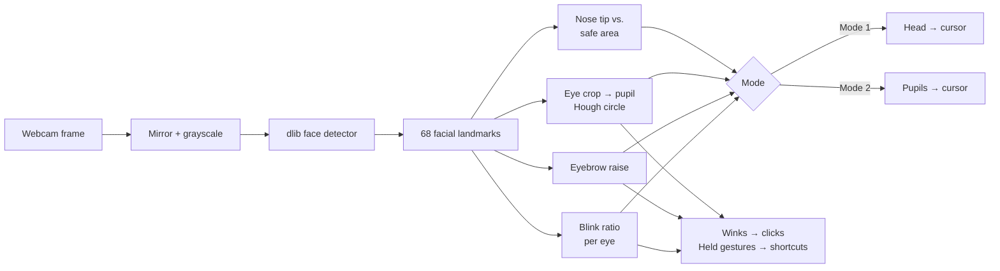

Every frame goes through dlib's frontal face detector and its 68-point shape predictor. All gestures are measured from those landmark positions, scaled by the size of the face so they work at different distances from the camera.

<p align="center">
  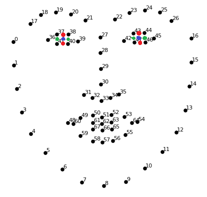
  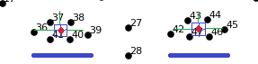
</p>

### Detecting a closed eye

Each eye has six landmarks (36–41 on the left, 42–47 on the right). The **blink ratio** divides the eye width (average of 36–39 and 42–45, shared by both eyes so head rotation does not skew it) by the eyelid opening (midpoint of 37–38 to midpoint of 41–40). The ratio rises sharply when the eye closes; above **5.7** the eye counts as closed.

A ratio alone confuses looking down with blinking, so an eye is only treated as closed when the pupil detector also finds no pupil in it. A **wink** is one eye closed while the other eye's pupil is still visible.

### Finding the pupil

The eye's bounding box, enlarged by a few pixels, is cropped from the grayscale frame, median-blurred to suppress eyelashes and reflections, and searched with OpenCV's Hough circle transform for a small dark circle (radius 1–8 px). The **eye centre** is the centre of the square formed by the four inner eyelid points (37, 38, 40, 41 and 43, 44, 46, 47).

<p align="center">
  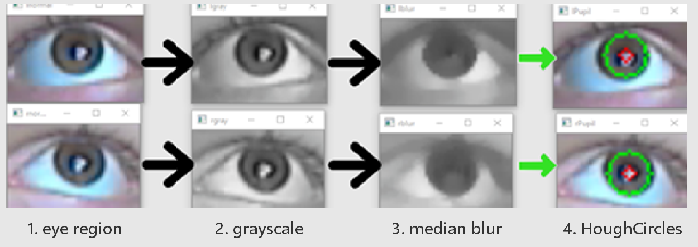
</p>

### Detecting raised eyebrows

A threshold is placed above the top of the nose bridge (landmark 27), at a distance proportional to the upper jaw segments (0–1 and 16–15). When the midpoint of the inner eyebrow ends (21–22) rises above it, the eyebrows count as raised.

<p align="center">
  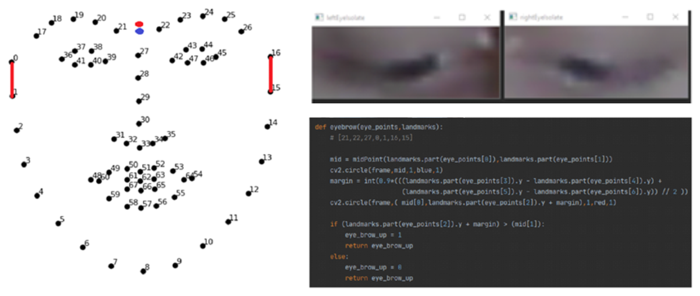
</p>

### Mode 1: head control

A face box is built from the jaw landmarks (0, 16 and 12) and a square **safe area** is placed at its centre, one eighth of the face width wide on each side. While the nose tip (landmark 30) stays inside the safe area, the cursor stays still, which is also where winks register as clicks. When the nose leaves the area, the cursor moves in that direction at a speed of *distance outside the area × Mode 1 speed*.

<p align="center">
  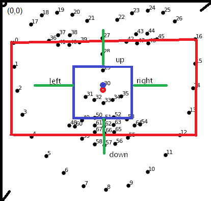
</p>

### Mode 2: eye control

The average offset of both pupils from their eye centres is compared with a dead zone of one eighth of the eye width. Looking up, left or right moves the cursor by *offset × Mode 2 speed*. Looking down is hard to see on a webcam because the upper eyelid follows the pupil, so raising the eyebrows moves the cursor down instead. With both pupils visible the cursor moves; a wink clicks.

### Shortcuts

Shortcuts use a hold-to-trigger rule: the gesture has to be detected in a set number of frames within a 5-second window. This tolerates the occasional misread frame without firing on a normal blink. A voice prompt confirms each shortcut.

| Shortcut | Gesture | Frames within 5 s | Action |
| --- | --- | --- | --- |
| Pause | Both eyes closed, eyebrows relaxed | 50 | Stops all mouse and keyboard control (for watching or reading) |
| Resume | Same gesture while paused | 50 | Restores control |
| Show desktop | Left eye closed, right eye open | 25 (Mode 1), 50 (Mode 2) | `Win + D` |
| On-screen keyboard | Right eye closed, left eye open | 25 | `Win + Ctrl + O` |
| File Explorer | Both eyes closed, eyebrows raised | 30 | `Win + E` |

## Interface

| | English | Turkish (original, 2021) |
| --- | --- | --- |
| Camera | 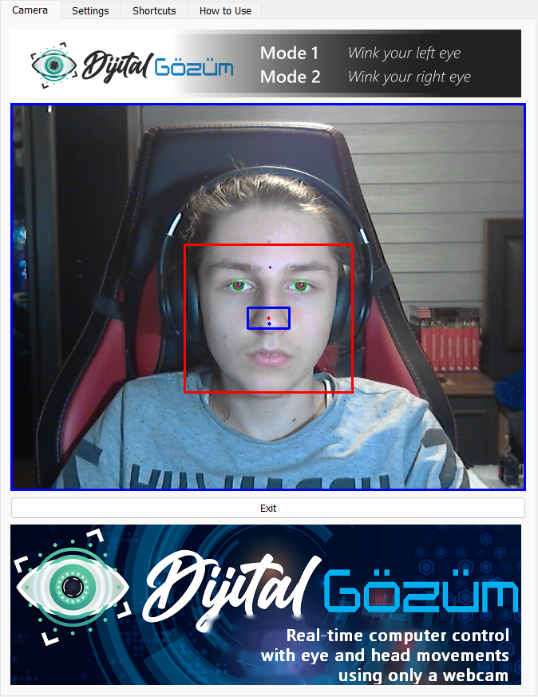 | 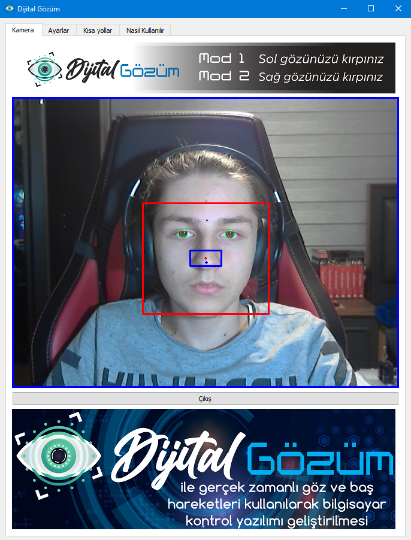 |
| Settings | 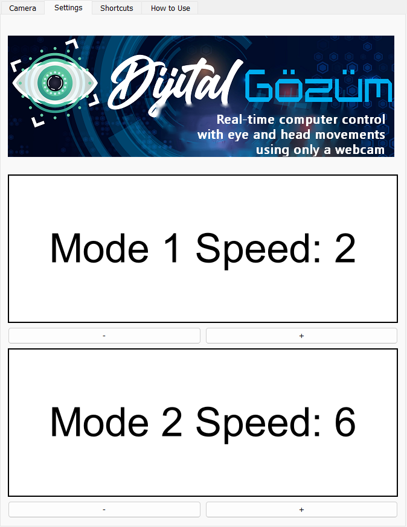 | 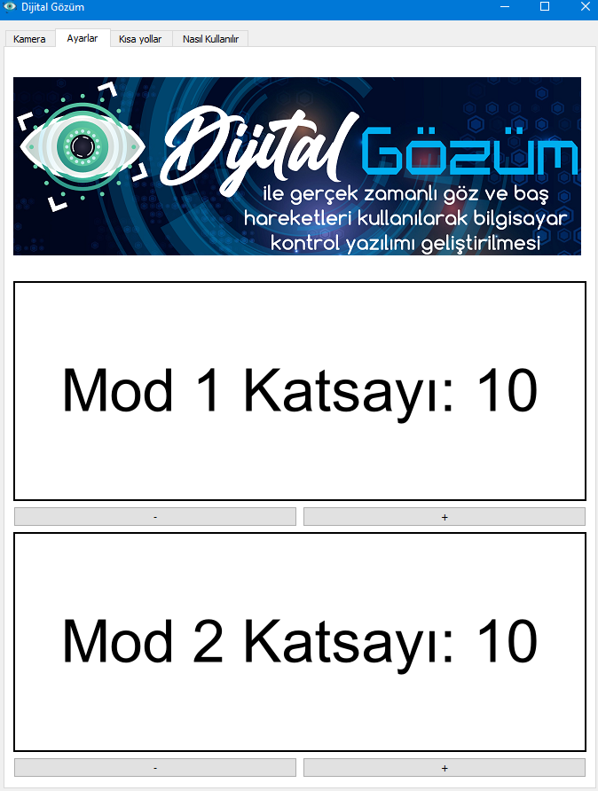 |
| Shortcuts | 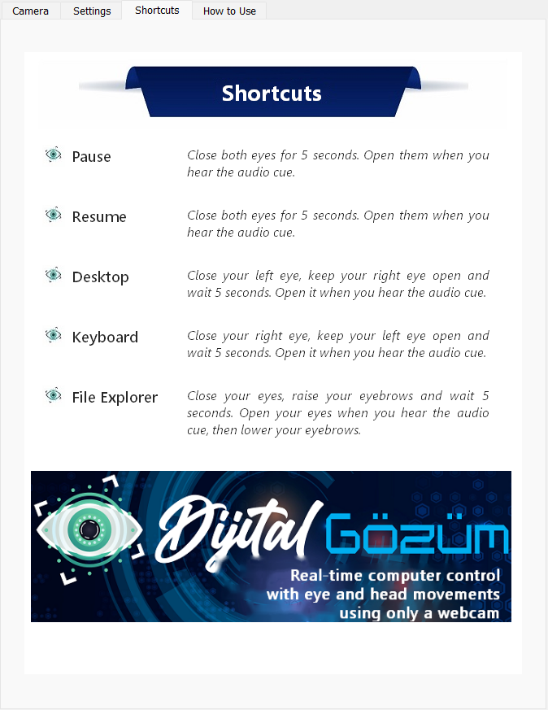 | 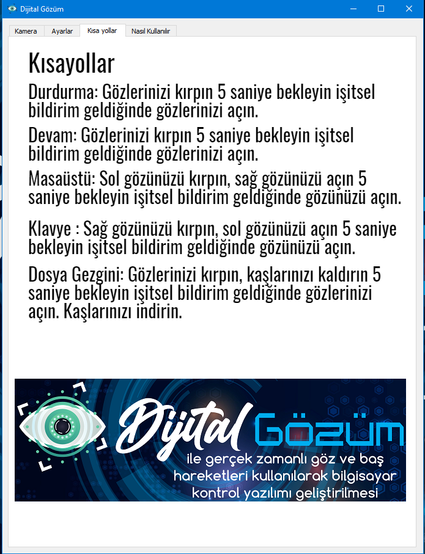 |
| How to Use | 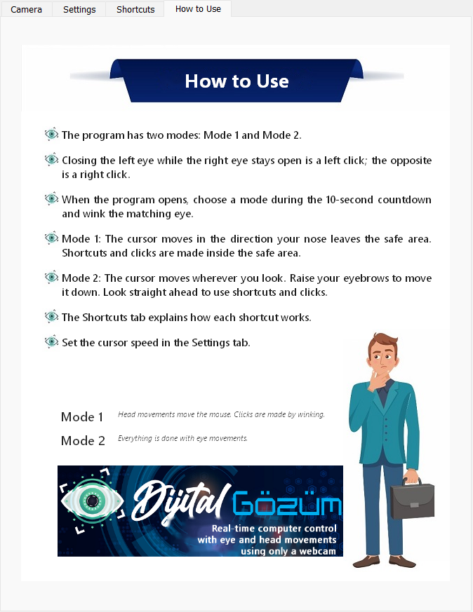 | 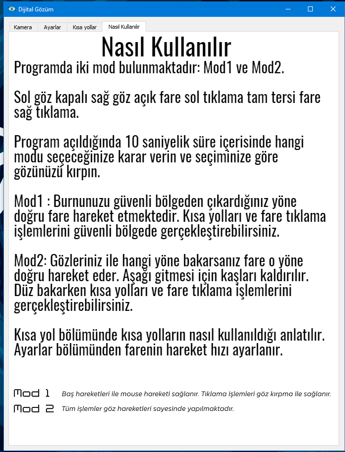 |

The Camera tab shows the live feed with the face box (red), safe area (blue), nose tip and detected pupils (green). No raw webcam recording from 2021 survived, so the English Camera screenshot shows the original 2021 camera output inside the new English interface.

<p align="center">
  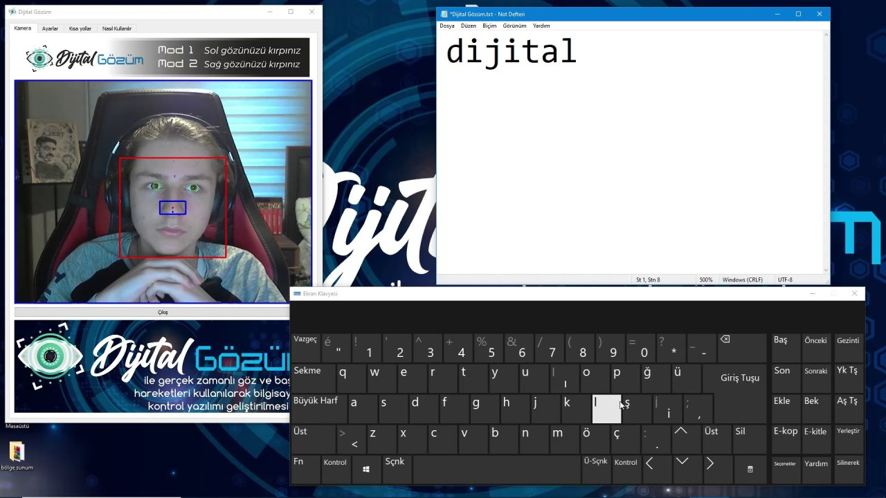
  <br>
  <em>Mode 1: typing on the on-screen keyboard with head movements and winks (March 2021 recording).</em>
</p>

## Demo videos

Screen recordings of the working application from March 2021, including full-length recordings. The videos are stored with Git LFS: open a file and use **View raw** to download it, or clone with Git LFS installed.

| Video | Length | Shows |
| --- | --- | --- |
| [mode1-head-control-demo.mp4](media/videos/mode1-head-control-demo.mp4) | 0:54 | Mode 1: typing on the on-screen keyboard with head movements and winks |
| [mode2-eye-control-demo.mp4](media/videos/mode2-eye-control-demo.mp4) | 1:01 | Mode 2: typing "dijital gözüm" with eye movements only |
| [pupil-tracking-test.mp4](media/videos/pupil-tracking-test.mp4) | 2:28 | Pupil detection test on the camera feed |
| [pupil-tracking-short.mp4](media/videos/pupil-tracking-short.mp4) | 0:21 | Short pupil tracking clip |
| [shortcuts/pause.mp4](media/videos/shortcuts/pause.mp4) | 0:10 | Pause shortcut |
| [shortcuts/resume.mp4](media/videos/shortcuts/resume.mp4) | 0:11 | Resume shortcut |
| [shortcuts/show-desktop.mp4](media/videos/shortcuts/show-desktop.mp4) | 0:06 | Show desktop shortcut |
| [shortcuts/on-screen-keyboard.mp4](media/videos/shortcuts/on-screen-keyboard.mp4) | 0:07 | On-screen keyboard shortcut |
| [shortcuts/file-explorer.mp4](media/videos/shortcuts/file-explorer.mp4) | 0:07 | File Explorer shortcut |
| [full-sessions/shortcuts-session.mp4](media/videos/full-sessions/shortcuts-session.mp4) | 4:42 | All shortcuts in one recording |
| [full-sessions/mode1-session.mp4](media/videos/full-sessions/mode1-session.mp4) | 5:00 | Full-length Mode 1 recording |
| [full-sessions/mode2-session.mp4](media/videos/full-sessions/mode2-session.mp4) | 4:50 | Full-length Mode 2 recording |
| [full-sessions/complete-session.mp4](media/videos/full-sessions/complete-session.mp4) | 12:07 | Complete 12-minute recording of both modes |

## Tech stack

| Component | Used for |
| --- | --- |
| Python 3 | Application language |
| dlib (`dlib-bin` wheel) | Face detection and the 68-point shape predictor |
| OpenCV | Frame capture, grayscale conversion, median blur, Hough circle transform, overlays |
| NumPy | Landmark geometry |
| PyQt5 (incl. QtMultimedia) | Tabbed GUI, background camera thread, voice prompts |
| PyAutoGUI | Mouse movement, clicks and keyboard shortcuts |

The 2021 version ran on Python 3.6.12 with OpenCV 4.4.0.42, dlib 19.8.1, NumPy 1.19.2, PyQt5 5.15.2, PyAutoGUI 0.9.50 and playsound 1.2.2.

## Installation

Tested on Windows 11 with Python 3.14. The shortcuts use Windows key combinations; see [Limitations](#limitations).

```powershell
git clone https://github.com/ozanulassivaci/mydigitaleye-2020.git   # needs Git LFS for videos and slides
cd mydigitaleye-2020
py -m venv .venv
.venv\Scripts\activate
pip install -r requirements.txt
python scripts/download_model.py
```

`download_model.py` fetches dlib's `shape_predictor_68_face_landmarks.dat` (about 64 MB compressed, 95 MB unpacked) into `models/`.

## Usage

```powershell
python src/main.py              # English interface
python src/main.py --lang tr    # Turkish interface
```

1. Sit 40–100 cm from the screen with your face lit from the front. A bright window or lamp behind you hides the pupils.
2. A 10-second countdown appears on the camera image. Before it ends, decide on a mode.
3. When the countdown reaches zero, wink the **left** eye for Mode 1 (head) or the **right** eye for Mode 2 (eyes).
4. Use the gestures above. Open the on-screen keyboard with the right-eye hold to type.
5. Adjust the cursor speed of each mode in the Settings tab if the cursor feels too slow or too fast.

| Option | Default | Description |
| --- | --- | --- |
| `--lang {en,tr}` | `en` | Interface language, including instruction pages and voice prompts |
| `--camera N` | `0` | Webcam index |
| `--video PATH` | | Read frames from a video file instead of the webcam |
| `--model PATH` | `models/shape_predictor_68_face_landmarks.dat` | Landmark model location |
| `--no-control` | off | Run detection and overlays without moving the mouse or pressing keys |

On an Intel Core i7-13650HX the tracker analyses a 640×480 frame in about 20 ms (roughly 50 frames per second). While the cursor is moving, PyAutoGUI's default 0.1 s pause after each call limits control to about 10 updates per second, as in the original version.

Run the unit tests with:

```powershell
python -m unittest
```

## Project structure

```text
mydigitaleye-2020/
├── src/
│   ├── main.py                  # command-line entry point
│   └── mydigitaleye/
│       ├── app.py               # PyQt5 window, camera thread, sound playback
│       ├── tracker.py           # modes, cursor control, shortcuts
│       ├── vision.py            # landmark geometry and pupil detection
│       ├── gestures.py          # hold-to-trigger gesture timing
│       ├── strings.py           # interface text (tr, en)
│       └── assets/              # interface images and voice prompts (tr, en)
├── tests/                       # unit tests (unittest)
├── scripts/download_model.py    # fetches the dlib landmark model
├── docs/                        # TÜBİTAK and TEKNOFEST reports, slides, technical notes
├── archive/                     # original code, Sept 2020 – March 2021
├── media/                       # screenshots, diagrams, branding, demo videos (Git LFS)
└── requirements.txt
```

## Competition documents

The project was submitted to the **TÜBİTAK 2204-A High School Research Projects Competition** (software category, image and speech processing theme) and the **TEKNOFEST Technology for the Benefit of Humanity competition** in 2021. The original reports and presentation material are in [`docs/`](docs), in Turkish:

- [TÜBİTAK 2204-A project report](docs/reports/tubitak-2204a-project-report.pdf) and its [source code appendix](docs/reports/tubitak-2204a-appendix-source-code.pdf)
- [TEKNOFEST preliminary design report](docs/reports/teknofest-preliminary-design-report.pdf)
- [Detection algorithms, with figures](docs/technical/detection-algorithms.pdf)
- Slide decks for the [jury](docs/presentations/presentation-slides-jury.pdf) and a [student audience](docs/presentations/presentation-slides-student.pdf), the [presentation script](docs/presentations/presentation-script.pdf) and [talking points](docs/presentations/presentation-talking-points.pdf)
- [Draft patent claims](docs/technical/patent-claims-draft.pdf)

See [`docs/README.md`](docs/README.md) for a description of each file.

## Development history

The project went through seven stages between September 2020 and March 2021: from experiments with an open-source gaze library, through its own landmark-based eye analysis and the "Face Cursor" prototype, to the tabbed Dijital Gözüm application. Each stage is preserved in [`archive/`](archive) with a summary of what changed.

The 2026 refactor keeps the detection logic, landmark indices and thresholds of the March 2021 version, splits the single 770-line script into modules, adds the English interface and unit tests, and fixes these bugs from the original:

- The Exit button crashed the program.
- A shortcut stopped responding permanently once its 5-second window was exceeded.
- PyAutoGUI's corner fail-safe froze all control when the cursor reached a screen corner, which a user without a physical mouse cannot recover from.
- Voice prompts blocked detection for the length of the recording.
- dlib could not open the model from a folder with non-ASCII characters (for example `Masaüstü`).

## Limitations

- **Windows only for shortcuts.** Desktop, on-screen keyboard and File Explorer shortcuts send Windows key combinations. Cursor movement and clicks work wherever PyAutoGUI does, but the app has only been tested on Windows.
- **Lighting-dependent pupil detection.** The Hough transform needs a front-lit face; backlighting, strong reflections on glasses or a dark room make pupils disappear, which the program then reads as closed eyes.
- **One face at a time.** The largest face in view is used; people passing behind the user are ignored, but two people at the same distance can confuse it.
- **No calibration or smoothing.** Cursor speed is linear in the offset, the cursor updates about 10 times per second while moving, and eye-mode precision is limited by webcam resolution; small targets can be hard to hit in Mode 2.
- **Fixed thresholds.** The 5.7 blink ratio and frame counts were tuned on one user and one webcam in 2021 and may need adjusting for others.
- **Mode switching requires a restart.** The mode is chosen once per session.
- **Not a medical device.** It was never tested with users with disabilities in a structured study.

## License

The source code is released under the [MIT License](LICENSE).

The dlib landmark model downloaded by `scripts/download_model.py` is trained on the iBUG 300-W dataset, whose license does not allow commercial use; check its terms before using this project commercially. The modules in `archive/07-2021-03-pupil-tracking-experiment` are adapted from [GazeTracking](https://github.com/antoinelame/GazeTracking) (MIT License).
